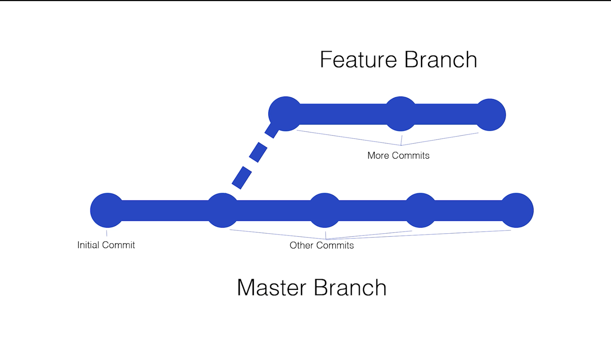

# Section 4 - Branches

Topics are:

* Git Branches
  * Listing all branches
    * `git branch`
    * `git branch -a`
  * Adding a branches
    * `git checkout -b <branch-name>`
      * be aware that there might be conventions for branch names depending on your team
  * Changing branches (e.g. change to `master`)
    * `git checkout master`
  * Merging a branch (e.g merge `feature1` into `master`)
    * `git merge feature1` after you checkout to the `master`
    * If you want to bring files from `master` to `feature1`, you can do:
      * `git checkout feature1`
      * `git merge master`
  * Removing a branch
    * `git branch` to print all branches
    * `git branch -d <branch_name>`
      * e.g. we want to delete branch called `feature1`
        * `git branch -d feature1`

```graph
         /-----0---0----0
        /              /
0------0----0----0----0
```

Here is the relationship between the feature branch and master branch:



---

## Instructions

* Make a new directory named `git_section_4`
* Change into this directory
* Initialise a git repository
* Create some files, add them to the staging area, and commit them to git
* List all current branches
* Create a new branch named **feature**
* List your branches and make sure you're in the **feature** branch, if not, change into it
* Create some files and make some changes to one of the existing files
* Commit these changes to the **feature** branch
* Checkout your master branch and merge the **feature** branch into **master**
* Remove the feature branch
* List all branches to ensure **feature** was removed

---

## Solutions

* Make a new directory named `git_section_4`
  * `mkdir git_section_4`
* Change into this directory
  * `cd git_section_4`
* Initialise a git repository
  * `git init`
* Create some files, add them to the staging area, and commit them to git
  * `touch file1.txt && touch file2.html && touch file3.css`
  * `git status`
  * `git add -A`
  * `git status`
  * `git commit -m "Add 3 new files"`
* List all current branches
  * `git branch`
* Create a new branch named **feature**
  * `git checkout -b feature`
* List your branches and make sure you're in the **feature** branch,
  * `git branch`
  * if not, change into it
    * `git checkout feature`
* Create some files and make some changes to one of the existing files
  * `touch file4.js && touch file5.html`
  * `echo "hello world" >> file1.txt`
* Commit these changes to the feature branch
  * `git status`
  * `git add -A`
  * `git status`
  * `git commit -m "Add feature files and add hello world to file1.txt"`
* Checkout your master branch and merge the **feature** branch into **master**
  * `git checkout master`
  * `git merge feature`
* Remove the **feature** branch
  * `git branch -d feature`
* List all branches to ensure feature was removed
  * `git branch` or maybe `git branch -a`
