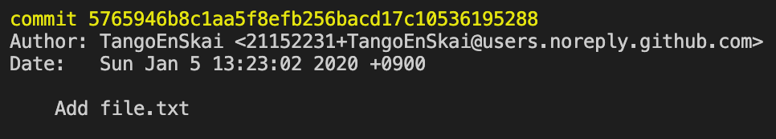

# Section 5 - Checking out commits

---

## Checking Out Commits

Git allows us to checkout any of the commits from our log. This means we can go back and look at the code from our earlier commits without losing any of our current commits. This is especially useful when you're current codebase is broken, but you have an earlier commit with working code.

**The steps are as follows:**

1) Make sure you're inside of your project's directory, using the `cd` command.

2) Once inside of the directory, use `git log` to view your log history.

3) You can scroll down to earlier commits by hitting enter (return)

4) Once you locate the commit you want to checkout, copy the hash key from the commit.

  - The hash key is the alphanumeric string that comes after the word "`commit`" (see yellow text in image below
  - The hash from above is the string of characters that begins with `5765946b`. You don't have to copy the entire sequence of characters, the first few will do.

5) Exit out of `git log` by pressing `Q`

6) Type `git checkout 5765946b` (replace the hash with one from your selected commit) and hit enter

7) Now you can look around inside of this commit and copy any code that you need. If you'd like to start working from this commit, but don't want to overwrite any of the code from the branch that you're currently on (in this case it's master) then you can type `git checkout -b <branch_name>` to create a new branch to begin working from.

8) Once you're done working from this commit, you can return to the most recent commit on the branch of your choosing by typing `git checkout <branch_name>`, in this case I typed `git checkout master` and it returned me to my most recent commit on the master branch.

Note: When you checkout an earlier commit, you are now in a "`detached HEAD`" state, this means that you are no longer on the commit that is being pointed to by the `HEAD`. The `HEAD`, in git, is a **pointer to the most recent commit of whichever branch you are currently on**.
